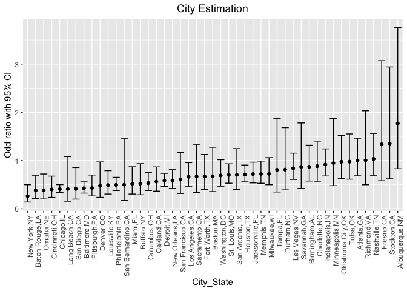
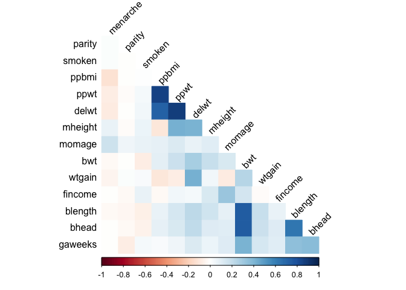
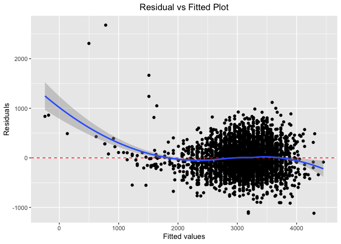
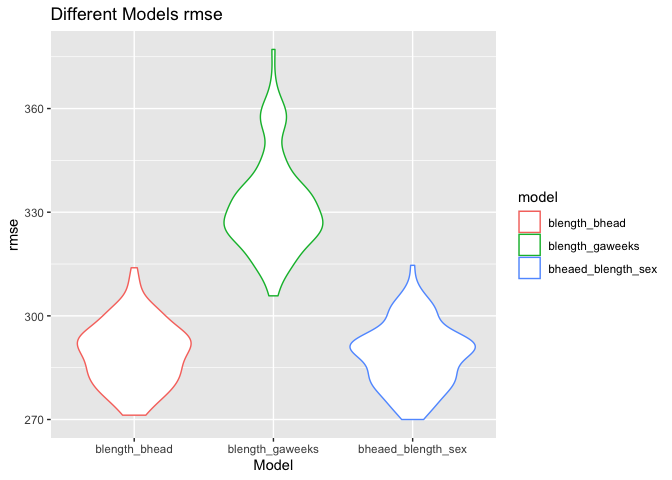

p8105_hw6_wm2473
================
2022-11-26

``` r
library(tidyverse)
```

    ## ── Attaching packages ─────────────────────────────────────── tidyverse 1.3.2 ──
    ## ✔ ggplot2 3.3.6      ✔ purrr   0.3.5 
    ## ✔ tibble  3.1.8      ✔ dplyr   1.0.10
    ## ✔ tidyr   1.2.1      ✔ stringr 1.4.1 
    ## ✔ readr   2.1.3      ✔ forcats 0.5.2 
    ## ── Conflicts ────────────────────────────────────────── tidyverse_conflicts() ──
    ## ✖ dplyr::filter() masks stats::filter()
    ## ✖ dplyr::lag()    masks stats::lag()

``` r
library(readxl)
library(rvest)
```

    ## 
    ## Attaching package: 'rvest'
    ## 
    ## The following object is masked from 'package:readr':
    ## 
    ##     guess_encoding

``` r
library(modelr)
library(corrplot)
```

    ## corrplot 0.92 loaded

``` r
library(ggplot2)
set.seed(1)
```

Problem 2

``` r
hd = read_csv("homicide-data.csv") %>% 
  janitor::clean_names() %>% 
  mutate(city_state = str_c(city,",", state), 
         homicides = case_when(disposition == "Closed without arrest" ~ 0, disposition == "Open/No arrest" ~ 0, disposition == "Closed by arrest" ~ 1), victim_age = as.numeric(victim_age), homicides = as.factor(homicides)) %>% 
    filter(!city_state %in% c("Tulsa,AL","Dallas,TX", "Phoenix,AZ", "Kansas City,MO"),victim_race %in% c("Black","White")) %>% 
  relocate(city_state)
```

    ## Rows: 52179 Columns: 12
    ## ── Column specification ────────────────────────────────────────────────────────
    ## Delimiter: ","
    ## chr (9): uid, victim_last, victim_first, victim_race, victim_age, victim_sex...
    ## dbl (3): reported_date, lat, lon
    ## 
    ## ℹ Use `spec()` to retrieve the full column specification for this data.
    ## ℹ Specify the column types or set `show_col_types = FALSE` to quiet this message.

    ## Warning in mask$eval_all_mutate(quo): NAs introduced by coercion

obtain the estimate and confidence interval

``` r
md = hd %>% 
    select(city_state, homicides, victim_age, victim_sex, victim_race) %>% 
  filter(city_state %in% "Baltimore,MD") 
  fit_1 = glm(homicides ~ victim_age+ victim_sex+ victim_race, family= binomial(), data = md) 


fit_1 %>% 
  broom::tidy() %>% 
   mutate(OR = exp(estimate), lower = exp(estimate - 1.96*std.error), upper = exp(estimate + 1.96*std.error)) %>% 
  filter(term == "victim_sexMale") %>% 
  select(term, OR, lower, upper)
```

    ## # A tibble: 1 × 4
    ##   term              OR lower upper
    ##   <chr>          <dbl> <dbl> <dbl>
    ## 1 victim_sexMale 0.426 0.325 0.558

``` r
city_odds_ci = function(city_df){
  fit_test = glm(homicides ~ victim_age + victim_sex + victim_race, data =city_df, family= binomial())  
    male_vs_female = filter(broom::tidy(fit_test), term == "victim_sexMale") %>% 
    mutate(OR = exp(estimate), lower = exp(estimate - 1.96*std.error), upper = exp(estimate + 1.96*std.error))
    
  return(male_vs_female)
  }
```

``` r
nested_df = hd %>%
  nest(alldata = -city_state) %>% 
  mutate(
    test_results = map(alldata, city_odds_ci)
  ) %>% 
  select(city_state, test_results) %>% 
  unnest(test_results) %>% 
select(city_state, OR, lower, upper)
```

Creat a plot

``` r
nested_df %>%
  mutate(city_state = fct_reorder(city_state, OR)) %>%
  ggplot(aes(x = city_state, y = OR)) +
  geom_point() +
  geom_errorbar(aes(ymin = lower, ymax = upper)) +
  theme(axis.text.x = element_text(angle = 90, hjust = 1), 
        plot.title = element_text(hjust = 0.5)) +
  labs(title = "City Estimation",
       x = "City_State",
       y = "Odd ratio with 95% CI") 
```

<!-- -->

``` r
#Comment: As we can seen from the graph, except "Fresno_CA", "Stockton_CA" and "Albuquerque_NM" the odd ratio is greater than 2, most cities have a odd ratro from 0 to 1. Also, the 95% CI(confident interval) of these three cities are wider than the rest. New York has the lowest odds ratio for solving homicides comparing male victims to female victims. 
```

Problem 3 Load the dataset, clean and check for missing data

``` r
bw = read_csv("birthweight.csv") %>% 
  janitor::clean_names() %>% 
   mutate(babysex = as.factor(babysex),frace = as.factor(frace),malform = as.factor(malform), mrace = as.factor(mrace)) 
```

    ## Rows: 4342 Columns: 20
    ## ── Column specification ────────────────────────────────────────────────────────
    ## Delimiter: ","
    ## dbl (20): babysex, bhead, blength, bwt, delwt, fincome, frace, gaweeks, malf...
    ## 
    ## ℹ Use `spec()` to retrieve the full column specification for this data.
    ## ℹ Specify the column types or set `show_col_types = FALSE` to quiet this message.

``` r
sum(is.na(bw)) ## make sure no missing value
```

    ## [1] 0

Propose a regression model for birthweight.(Based on the a data-driven
model-building)

``` r
bw %>%
  select(-babysex,-frace,-malform,-mrace,-pnumlbw,-pnumsga) %>%
  cor(method = "pearson") %>%
  corrplot(
    method = "color",
    type = "lower",
    tl.col = "Black",
    tl.srt = 45,
    diag = F,
    order = "AOE"
  )
```

<!-- -->

``` r
fit_bwt = lm(bwt ~ blength + bhead, data = bw) 

fit_bwt %>%   
  broom::tidy() %>% 
  knitr::kable(digits = 3)
```

| term        |  estimate | std.error | statistic | p.value |
|:------------|----------:|----------:|----------:|--------:|
| (Intercept) | -6029.620 |    95.821 |   -62.926 |       0 |
| blength     |    85.030 |     2.076 |    40.955 |       0 |
| bhead       |   146.021 |     3.489 |    41.851 |       0 |

``` r
bw %>%
  modelr::add_residuals(fit_bwt) %>%
  modelr::add_predictions(fit_bwt) %>%
  ggplot(aes(x = pred, y = resid)) +
  geom_point() +
  geom_hline(yintercept = 0,
             col = "red",
             linetype = "dashed") +
  geom_smooth(method = "loess") +
  labs(title = "Residual vs Fitted Plot",
       x = "Fitted values",
       y = "Residuals") +
  theme(plot.title = element_text(hjust = 0.5))
```

    ## `geom_smooth()` using formula 'y ~ x'

<!-- -->

Describe the modeling process 1. Make a multiple Pearson’s correlation
coefficient matrix(heat graph) and we can see which variable has the
highest correlation with bwt(baby’s birth weight). And found that the
color of blength(baby’s length at birth) and bhead(baby’s head
circumference at birth) is darker compared with the other which means
that these two variable have a high correlation with bwt.

2.  Build a linear regression model for bhead and blength with bwt.

3.  Build another linear regression model which may depend on baby’s
    length and baby’s head circumference at birth.

4.  From the graph we can see that the blue line close to the dashed
    line especially from the value 1500 to 4000 kind of overlapping. We
    can say that this linearity is reasonable.

Compare your model to two others:

``` r
cv = modelr::crossv_mc(bw, 100) 
cv %>%
  mutate(train = map(train, as_tibble),
         test = map(test, as_tibble)) %>%
  mutate(
    mod_blength_bhead = map(train, ~ lm(bwt ~ blength + bhead, data = .x)),
    mod_blength_gaweeks = map(train, ~ lm(bwt ~ blength + gaweeks, data = .x)),
    mod_bheaed_blength_sex = map(
      train,
      ~ lm(bwt ~ babysex + bhead + blength + babysex * bhead + 
          babysex * blength + bhead * blength + 
          babysex * bhead * blength,data = .x))
  ) %>%  
mutate(
    rmse_blength_bhead = map2_dbl(mod_blength_bhead, test, ~ rmse(model = .x, data = .y)),
    rmse_blength_gaweeks = map2_dbl(mod_blength_gaweeks, test, ~ rmse(model = .x, data = .y)),
    rmse_bheaed_blength_sex = map2_dbl(mod_bheaed_blength_sex, test, ~ rmse(model = .x, data = .y))) %>% 
  select(starts_with("rmse")) %>% 
  pivot_longer(
    everything(),
    names_to = "model", 
    values_to = "rmse",
    names_prefix = "rmse_")%>% 
  mutate(model = fct_inorder(model)) %>% 
  ggplot(aes(x = model, y = rmse, color = model)) + 
  geom_violin() + 
  labs(title = "Different Models rmse",
       y = "rmse",
       x = "Model") 
```

<!-- -->

``` r
#Conclusion: As we can seen from the graph, when rmse value larger in model 2, model 1 and 3 is more accurate. We can conclude that the error rate of linear regression model 2 is high.
```
